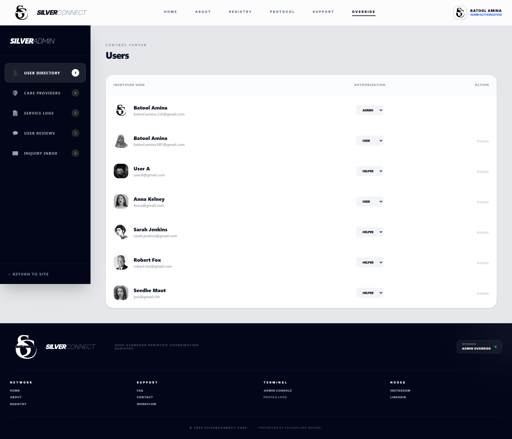
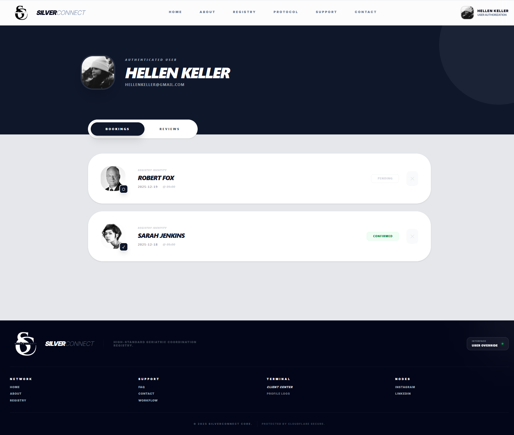
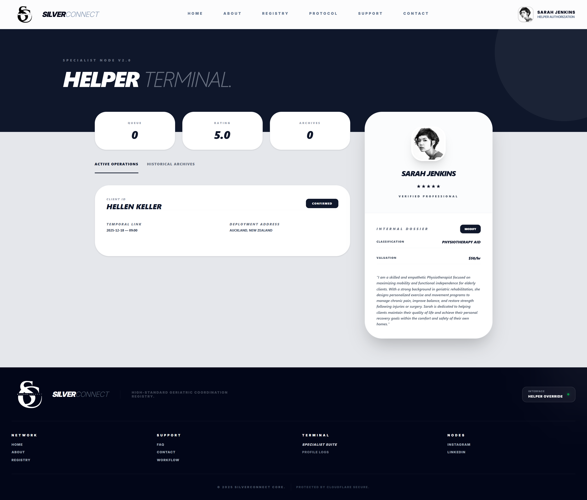

# SilverConnect (Finding Helper for Elderly People)

SilverConnect is a production-grade, full-stack geriatric care coordination platform designed as a **registry and matchmaking protocol**, not a traditional medical website.  
It connects families with **verified care providers** through a secure, governed, and professionally moderated digital ecosystem.

This system emphasizes **trust, compliance, and operational clarity**, delivering a SaaS-level experience for a traditionally fragmented sector.

## Deployment

### Frontend (Vercel)
https://silver-connect-blush.vercel.app/

### Backend (Render)
https://backend-minor-project.onrender.com

### Backend Repository
https://github.com/BatoolAmina/backend-minor-project

## PROJECT VISUALS
### HOME PAGE

### ADMIN DASHBOARD

### USER DASHBOARD

### HELPER DASHBOARD


**Problem**  
Finding reliable elderly care is difficult due to unverified providers, lack of accountability, and fragmented communication.
**Solution**  
SilverConnect functions as a **central registry** where:
- Helpers are verified and approved
- Services are transparently logged
- Payments follow an escrow-style confirmation model
- Admins actively govern the platform

## Tech Stack
### Frontend
- **Framework:** Next.js 14 (App Router)
- **Styling:** TailwindCSS
- **Deployment:** Vercel
### Backend
- **Runtime:** Node.js
- **Framework:** Express
- **Database:** MongoDB Atlas
- **Authentication:** JWT


### Frontend Environment (`.env.local`)
```env
NEXT_PUBLIC_API_BASE_URL=https://backend-minor-project.onrender.com
```

### Clone the repository
```bash
git clone https://github.com/BatoolAmina/silver_connect.git
cd silver_connect
```

### Install Dependencies

```bash
npm install
```

### Start the Development Server

```bash
npm run dev
```

The app will be available at:  
http://localhost:3000
